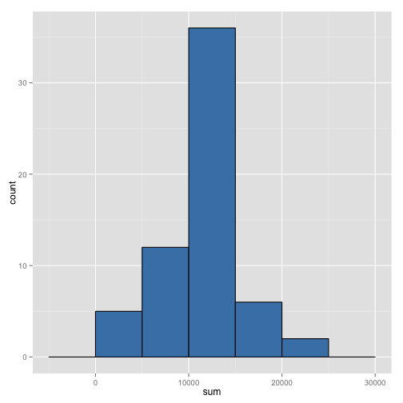

# Reproducible Research: Peer Assessment 1


## Loading and preprocessing the data


```r
library(data.table)
library(ggplot2)

setwd("/Users/cching/Coursera/Reproducible Research/RepData_PeerAssessment1")
unzip("activity.zip")
data <- data.table(read.csv("activity.csv", stringsAsFactors = FALSE))
str(data)
```

```
## Classes 'data.table' and 'data.frame':	17568 obs. of  3 variables:
##  $ steps   : int  NA NA NA NA NA NA NA NA NA NA ...
##  $ date    : chr  "2012-10-01" "2012-10-01" "2012-10-01" "2012-10-01" ...
##  $ interval: int  0 5 10 15 20 25 30 35 40 45 ...
##  - attr(*, ".internal.selfref")=<externalptr>
```

```r
colnames(data)
```

```
## [1] "steps"    "date"     "interval"
```

```r
# Pre-processing the data
# 1. Make steps numeric so that we can assign the mean for our "impuning" stage
# 2. Add weekday or weekend so we can sum intervals for weekdays and weekends
```

## What is mean total number of steps taken per day?


```r
totals <- data[, sum(steps, na.rm = TRUE), by = date]
totals_mean <- mean(totals$V1)
totals_median <- median(totals$V1)
hist(totals$V1)
```

 

### The mean total steps is 9354.2295 and the median is 10395

## What is the average daily activity pattern?


```r
avgs <- data[, mean(steps, na.rm = TRUE), by = interval]
max_avgs <- avgs[avgs[, V1 == max(V1)], ]
plot(avgs, type = "l")
```

 

### The interval with the maximum average number of steps is 835 with a value of 206.1698

## Imputing missing values


```r
# Compare complete.cases with is.na(steps), if the same
# then all NA are in steps
sum(!complete.cases(data))
```

```
## [1] 2304
```

```r
sum(is.na(data$steps))
```

```
## [1] 2304
```

```r
nas <- data[, is.na(steps)]
sum(nas)
```

```
## [1] 2304
```

```r
d1 <- data[, steps := as.numeric(steps)]

count <- 0
    
for (i in 1:nrow(d1)) {
    
    if (is.na(d1[i]$steps)) {
        count <- count + 1
        d1[i]$steps = avgs[interval == d1[i]$interval]$V1
    }
}

count
```

```
## [1] 2304
```

```r
totals <- d1[, sum(steps, na.rm = TRUE), by = date]
totals_mean <- mean(totals$V1)
totals_median <- median(totals$V1)
hist(totals$V1)
```

 

### The mean total steps is 1.0766 &times; 10<sup>4</sup> and the median is 1.0766 &times; 10<sup>4</sup>

## Are there differences in activity patterns between weekdays and weekends?

```r
d1_weekdays <- ifelse(weekdays(as.Date(d1$date)) == "Saturday" | weekdays(as.Date(d1$date)) == "Sunday", "weekend", "weekday")
d1 <- cbind(d1, as.factor(d1_weekdays))

# This doesn't work.  We need to separate the intervals
# based on weekend|weekday, not all together.
avgs <- d1[, mean(steps, na.rm = TRUE), by = list(interval, V2)]
max_avgs <- avgs[avgs[, V1 == max(V1)], ]
#plot(avgs, type = "l")
qplot(interval, V1, data = avgs, facets = . ~ V2, geom = "line")
```

 
